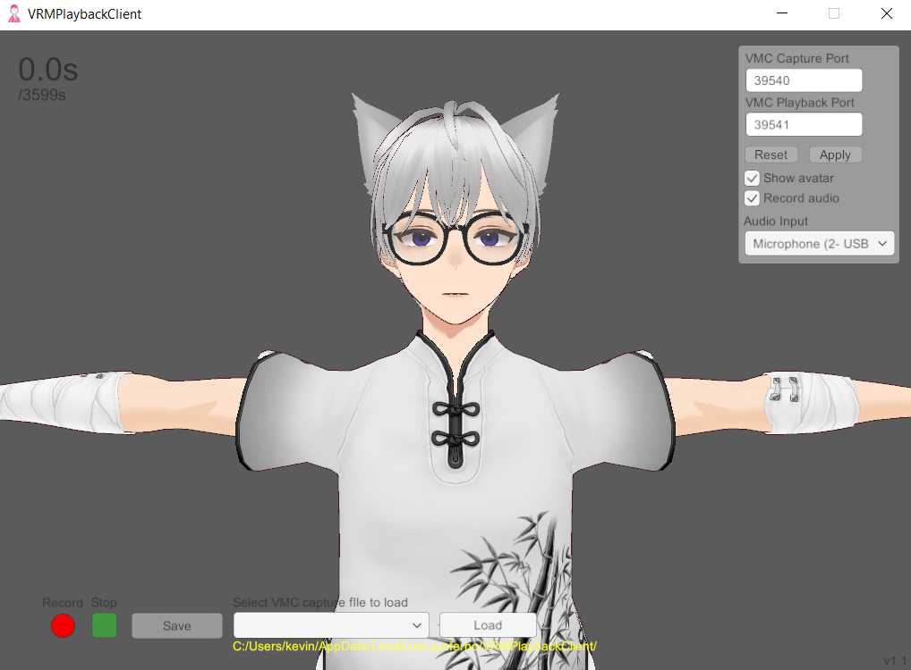

# VRMPlaybackClient
Capture and playback of VRM motion data in VMC protocol

[Read about VMC Protocol](https://protocol.vmc.info/english.html)

Built with [UniGLTF](https://github.com/ousttrue/UniGLTF/releases/tag/v1.27), [UniVRM](https://github.com/vrm-c/UniVRM/releases/tag/v0.113.0), [uOSC](https://github.com/hecomi/uOSC/releases/tag/v2.2.0), [EVMC4U](https://github.com/gpsnmeajp/EasyVirtualMotionCaptureForUnity/releases/tag/v4.0a) (MIT License)

### To use
Unzip and execute [VRMPlaybackClient.exe](https://github.com/kevinjycui/VRMPlaybackClient/releases) (Windows only). It should look like so:

Open VMC software (such as [VSeeFace](https://www.vseeface.icu/)) and toggle on sending/forwarding OSC/VMC protocol data to the port `39540`.

Play the scene. It should begin copying the playback in the VMC software. If you choose to record audio, ensure you have selected a microphone that is accessible by VRMPlaybackClient. Captures with audio are limited to 1 hour (59m59s) while captures without audio are unlimited. Record yourself by clicking he red "Record" button. Stop the recording by clicking the green "Stop" button. Save the recording by clicking the "Stop" button once it finishes. Saved recordings will go in `~/AppData/LocalLow/Junferno/VRMPlaybackClient`. To load a recording, select the file from the dropdown and click "Load".

### Playback in third-party VMC player
Disable "Show avatar" and paste the port under VMC Playback Port to the receiving port of your third-party VMC player (e.g. in VSeeFace, General Settings > OSC/VMC receiver (disables tracking)).

### Adjustable Parameters
 * VMC Capture Port: Port for your third-party VMC motion capture software.
 * VMC Playback Port: Port for VMC VRMPlaybackClient; can be used to send data to another VMC player.
 * Show avatar: Show the avatar in VMCPlaybackClient. Must disable this to send data to another VMC player.
 * Record audio: Record audio in capture.
 * Audio Input: Device to record audio. Make sure it's accessible by VRMPlaybackClient.
